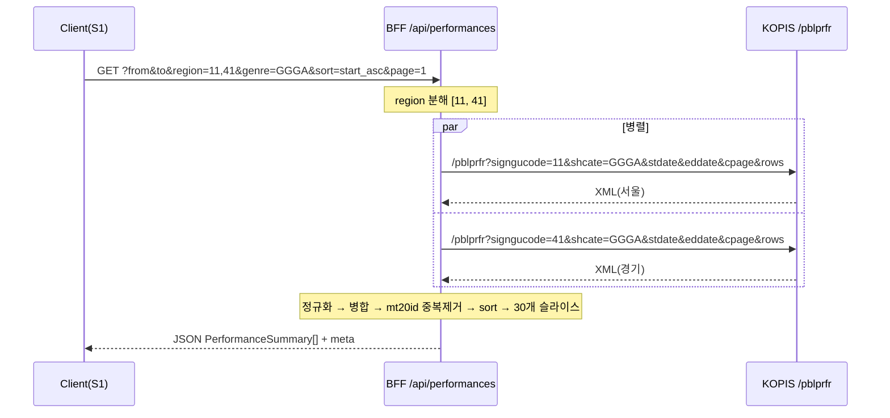
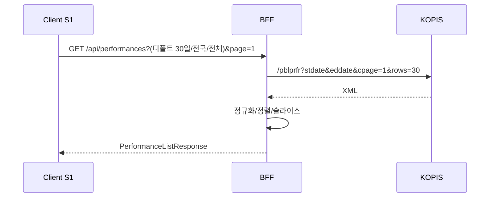
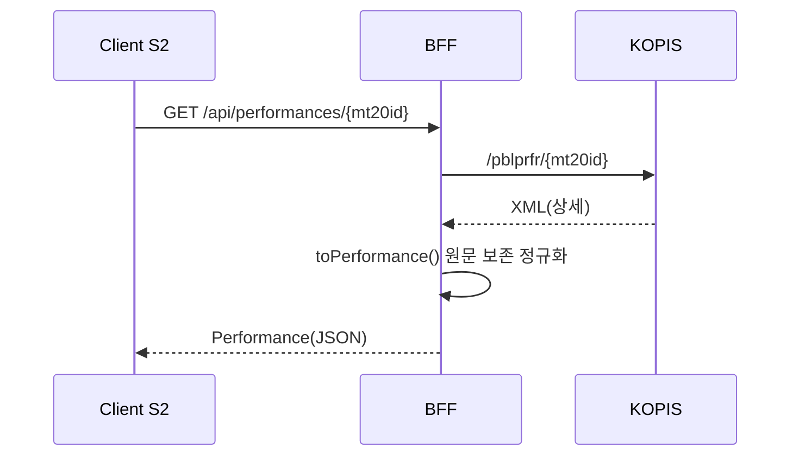
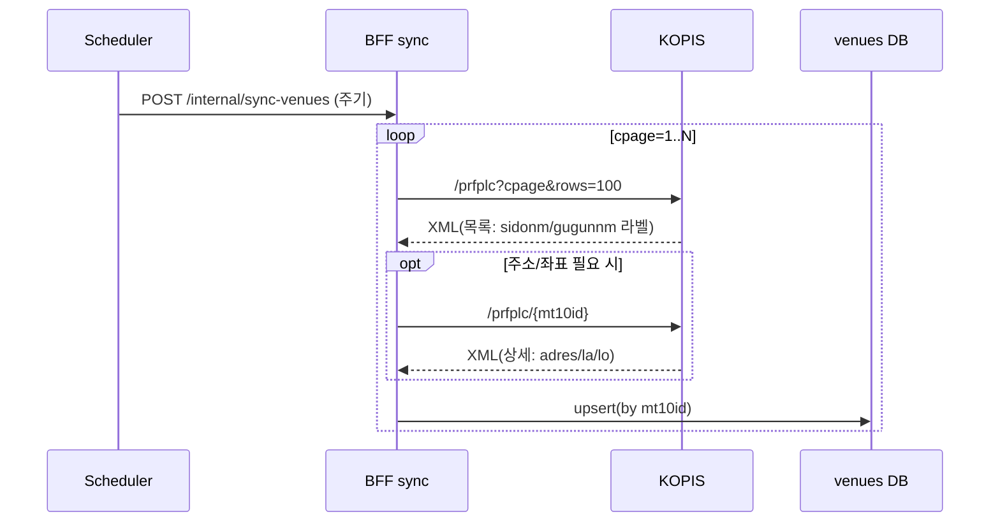

# Riff — KOPIS API 연동 명세 (KOPIS Integration)

| 항목 | 내용 |
|---|---|
| 서비스명 | Riff (리프) |
| 버전 | v0.1 (MVP) |
| 작성일 | 2026-06-08 |
| 검증일 | 2026-06-08 |
| 상태 | **검증 완료(공식 명세 대조)** |
| 기반 문서 | [`overview.md`](../../overview.md) · [`features.md`](../../features.md) · [`screens.md`](../product/screens.md) · [`data-model.md`](../architecture/data-model.md) |
| 관련 문서 | [`kopis-codes.md`](./kopis-codes.md) |
| 공식 출처 | KOPIS OPEN API 항목확인 `https://www.kopis.or.kr/por/cs/openapi/openApiList.do?menuId=MNU_00074` · 공통코드 PDF `https://www.kopis.or.kr/upload/openApi/공연예술통합전산망OpenAPI공통코드.pdf` |

> 본 문서는 Riff v0.1이 사용하는 **KOPIS Open API 연동 설계**를 정의한다. 파라미터·응답 필드는 **2026-06-08 KOPIS 공식 API 명세(항목확인 페이지) 및 공통코드 PDF로 대조 검증**했다. 검증으로 정정된 항목은 본문에 "정정" 표기.

---

## 목차

- 1. 개요 / 베이스 URL / 인증
- 2. 사용 API 4종 (검증된 명세)
- 3. 호출 전략 (31일 / 지역 다중 / 정렬)
- 4. BFF 레이어 설계
- 5. 화면·기능별 호출 시퀀스
- 6. 응답 예시 & 정규화 매핑
- 7. 에러 처리 / 레이트리밋 / 캐싱
- 8. 환경 변수 / 보안
- 9. 기능/결정 매핑
- 10. 검증 결과 요약 / 남은 확인 항목

---

## 1. 개요 / 베이스 URL / 인증

### 1.1 베이스 URL ✅
- **`http://www.kopis.or.kr/openApi/restful`** (HTTP). 공식 명세의 요청 URL이 `http://kopis.or.kr/openApi/restful/...` 형태. (정정: 이전 "확인 필요"였던 스킴/경로 → HTTP, `/openApi/restful` 확정.)
- HTTPS 지원 여부는 미보장이므로, BFF에서 호출 시 HTTP 사용. 단 **서버 내부 호출**이므로 브라우저 혼합콘텐츠 문제 없음(클라이언트는 BFF의 HTTPS만 사용).

### 1.2 인증 — 서비스키 ✅
- 모든 요청에 쿼리 파라미터 **`service`** 로 인증키 전달(크기 60). (정정: 파라미터명 `service` 확정.)
- 서비스키는 **서버(BFF) 전용**, 클라이언트 비노출(§8).

### 1.3 응답 포맷 ✅
- **XML**. 공식 예시 모두 XML(`<dbs><db>…`). JSON 옵션 미확인 → **BFF에서 XML 파싱 후 도메인 JSON 정규화** 전제.
- 파서: `fast-xml-parser` 등. 단일/배열 혼재 필드(styurl, relate) 정규화 주의(§6).

---

## 2. 사용 API 4종 (검증된 명세)

### 2.1 공연목록 — `GET /pblprfr` ✅
S1 메인 그리드(F1). 최대 100건 조회.

| 파라미터 | 필수 | 크기 | 의미 | 샘플 |
|---|---|---|---|---|
| `service` | ✅ | 60 | 인증키 | (서버 주입) |
| `stdate` | ✅ | 8 | 공연시작일 yyyyMMdd | 20230101 |
| `eddate` | ✅ | 8 | 공연종료일 yyyyMMdd | 20230630 |
| `cpage` | ✅ | 3 | 현재 페이지(1-base) | 1 |
| `rows` | ✅ | 3 | 페이지당 건수(최대 100) | 30 |
| `shprfnm` | ⬜ | 100 | **공연명 검색**(URLEncoding) | 사랑 |
| `shprfnmfct` | ⬜ | 100 | 공연시설명 검색 | 예술의전당 |
| `shcate` | ⬜ | 4 | 장르코드 | AAAA |
| `prfplccd` | ⬜ | (가변) | 공연장코드 | FC000001-01 |
| `signgucode` | ⬜ | 2 | 지역(시도)코드 | 11 |
| `signgucodesub` | ⬜ | 4 | 지역(구군)코드 | 1111 |
| `kidstate` | ⬜ | 1 | 아동공연여부 | Y |
| `prfstate` | ⬜ | 2 | 공연상태코드 | 01 |
| `openrun` | ⬜ | 2 | 오픈런 | Y |
| `afterdate` | ⬜ | 8 | 해당일 이후 등록/수정분만 | 20230101 |

> 정정/발견:
> - **`shprfnm`(공연명 검색)이 API에 존재**. v0.1은 검색 미노출(∴ D10)이나 v0.2 검색은 이 파라미터로 구현 가능.
> - **정렬 파라미터 없음** → 정렬은 BFF/클라이언트 처리(F4).
> - `prfplccd` 샘플 `FC000001-01`(명세 크기 표기 4는 오기로 보임, 실제 FC형 코드).

응답 필드(목록): `mt20id, prfnm, prfpdfrom, prfpdto, fcltynm, poster, area, genrenm, openrun, prfstate`. (목록에는 `mt10id`·장르코드·지역코드 없음 → 카드 장르는 `genrenm` 라벨로 매핑.)

### 2.2 공연상세 — `GET /pblprfr/{mt20id}` ✅
S2 상세(F3).

| 파라미터 | 필수 | 크기 | 의미 |
|---|---|---|---|
| `{mt20id}` | ✅ | 8 | 공연 ID(경로) |
| `service` | ✅ | 60 | 인증키 |

응답 필드(검증된 전체):

| 필드 | 설명 | Riff 사용 |
|---|---|---|
| `mt20id` | 공연ID | id |
| `mt10id` | **공연시설ID** (예 FC001431) | venueId |
| `mt13id` | **공연장ID** (예 FC001431-01) | hallId(참고) |
| `prfnm` | 공연명 | title |
| `fcltynm` | 공연시설명 | venueName |
| `frstregdt` | 최초등록일 | (미사용) |
| `updatedate` | 최종수정일 | (미사용) |
| `prfpdfrom`/`prfpdto` | 기간 | period |
| `prfcast` | 출연진 | **원문 보존** |
| `prfcrew` | 제작진 | **원문 보존** |
| `prfruntime` | 런타임 | runtime |
| `prfage` | 관람연령 | **원문 보존** |
| `entrpsnm` | 기획제작사(전체) | producers.main |
| `entrpsnmP` | **제작사** | producers.producer |
| `entrpsnmA` | **기획사** | producers.planner |
| `entrpsnmH` | **주최** | producers.host |
| `entrpsnmS` | **주관** | producers.supervisor |
| `pcseguidance` | 티켓가격 | **원문 보존** |
| `poster` | 포스터 | posterUrl |
| `sty` | 줄거리 | **원문 보존** |
| `area` | 지역(라벨) | area |
| `genrenm` | 장르(라벨) | genre/genreLabel |
| `openrun` | 오픈런 Y/N | openrun |
| `visit` | 내한 Y/N | (참고) |
| `child` | 아동 Y/N | (참고) |
| `daehakro` | 대학로 Y/N | (참고) |
| `festival` | 축제 Y/N | (참고) |
| `musicallicense`/`musicalcreate` | 뮤지컬 라이선스/창작 | (참고) |
| `prfstate` | 공연상태(라벨) | state |
| `dtguidance` | 공연시간 | **원문 보존** |
| `styurls > styurl[]` | 소개이미지 목록 | introImages |
| `relates > relate[]` | 예매처 목록 | bookings |
| `relate.relatenm` | **예매처명** | booking.name |
| `relate.relateurl` | **예매처 URL** | booking.url |

> **정정(중요):** 예매처 필드는 **`relatenm`(예매처명) / `relateurl`(URL)**. 이전 문서의 `relatenmr`는 오류 → `relatenm`으로 수정. 또한 일부 `relate`는 `relatenm` 없이 `relateurl`만 존재 → **예매처명 optional 처리 필수**(이름 없으면 URL/도메인 또는 "예매처" 표기).
>
> **정정:** 제작 정보 매핑 — `entrpsnmP`=제작사, `entrpsnmA`=기획사, `entrpsnmH`=주최, `entrpsnmS`=주관. (이전 문서의 A=주관/S=협찬 매핑은 오류.)

### 2.3 공연시설목록 — `GET /prfplc` ✅
공연장 마스터 동기화(D5).

| 파라미터 | 필수 | 크기 | 의미 | 샘플 |
|---|---|---|---|---|
| `service` | ✅ | 60 | 인증키 | |
| `cpage` | ✅ | 3 | 페이지 | 1 |
| `rows` | ✅ | 3 | 건수(최대 100) | 100 |
| `shprfnmfct` | ⬜ | 100 | 공연시설명 검색 | 예술의전당 |
| `fcltychartr` | ⬜ | 4 | 시설특성코드 | 1 |
| `signgucode` | ⬜ | (2) | 지역(시도)코드 | 11 |
| `signgucodesub` | ⬜ | 4 | 지역(구군)코드 | 1111 |
| `afterdate` | ⬜ | 8 | 이후 등록/수정분 | 20230101 |

응답 필드(목록): `mt10id, fcltynm, mt13cnt(공연장 수), fcltychartr(라벨), sidonm(시도 라벨), gugunnm(구군 라벨), opende(개관연도)`.

> **정정/주의:** 시설**목록** 응답은 지역을 **`sidonm`/`gugunnm` 라벨**(예 "경북"/"경주시")로 반환하며 **코드(signgucode)는 주지 않는다.** 또한 **주소(`adres`)·좌표(`la`/`lo`)는 목록에 없음** → 상세 호출로 보강. (∴ data-model Venue 정정.)

### 2.4 공연시설상세 — `GET /prfplc/{mt10id}` ✅
공연장 상세(주소/좌석/홀 목록).

| 파라미터 | 필수 | 크기 | 의미 |
|---|---|---|---|
| `{mt10id}` | ✅ | 8 | 공연시설 ID(경로) |
| `service` | ✅ | 60 | 인증키 |

응답 핵심 필드: `mt10id, fcltynm, mt13cnt, fcltychartr, opende, seatscale(객석수), telno, relateurl(홈페이지), adres(주소), la(위도), lo(경도)`, 편의/장애 시설 플래그(restaurant/cafe/parkinglot/…), 그리고 `mt13s > mt13[]`(공연장/홀 목록: `mt13id, prfplcnm, seatscale, stage*`).

> 주의: 상세 응답에도 `signgucode`/`signgucodesub`는 없음(주소 텍스트 `adres`만). 시도/구군 **코드**가 필요하면 (a) `adres`/`sidonm`→코드 매핑 또는 (b) 동기화 시 `signgucode`로 필터 호출해 역으로 코드 부여. (∴ §6.3, data-model §5 정정.)

---

## 3. 호출 전략

### 3.1 월별 31일 제약 (D3) ✅
- **31일 제약은 API가 강제** — 초과 시 결과코드 `05 "최대 31일까지 조회가능합니다"` 반환. (정정: 이전 "제약 주체 확인 필요" → **API 강제 확정**.)
- 따라서 BFF는 `eddate-stdate ≤ 31일` 보장. 잘못된 입력은 `stdate+31일`로 보정 + 클라이언트 토스트 플래그(∴ screens D3).
- v0.2: 31일 초과 시 분할 호출로 확장.

### 3.2 지역 다중 선택 → 병렬 호출 + 병합 (D4)
KOPIS는 단일 `signgucode`만 수용 → BFF가 지역별 병렬 호출 후 병합.



병합: 중복 제거(mt20id), `sort` 재정렬(prfpdfrom), 30개 슬라이스. 페이지 경계 정확도/부하는 실측(§10).

### 3.3 정렬 (F4)
API 정렬 파라미터 없음(확정) → BFF가 `prfpdfrom` 기준 ASC/DESC 정렬.

### 3.4 페이지네이션 (F1.2)
`cpage`(1-base)/`rows`(≤100, v0.1=30). 페이지 번호 URL 미반영. 다중 지역은 BFF가 충분 fetch 후 슬라이스.

---

## 4. BFF 레이어 설계

### 4.1 BFF 엔드포인트
| BFF | 역할 | 화면 | KOPIS |
|---|---|---|---|
| `GET /api/performances` | 목록(필터/정렬/페이지, 지역 병합) | S1 | `/pblprfr` ×1~N |
| `GET /api/performances/[mt20id]` | 상세 | S2 | `/pblprfr/{mt20id}` |
| `GET /api/venues?q=` | 공연장 자동완성(자체 DB) | S1 필터 | (DB) |
| `POST /internal/sync-venues` | 공연장 동기화 | — | `/prfplc`(+상세) |

### 4.2 레이어 구조
```
src/
  app/api/performances/route.ts          # 목록(병합/정렬/슬라이스)
  app/api/performances/[mt20id]/route.ts # 상세
  app/api/venues/route.ts                # 자동완성(DB)
  server/kopis/{client,parse-xml,normalize,merge,raw-types}.ts
  server/cache/index.ts
  server/venues/{sync,repo}.ts
  domain/{types,filter-url}.ts
```

### 4.3 KOPIS 클라이언트(개략)
```ts
const BASE = process.env.KOPIS_BASE_URL!;     // http://www.kopis.or.kr/openApi/restful
const KEY  = process.env.KOPIS_SERVICE_KEY!;  // 서버 전용
export async function kopisGet(path: string, params: Record<string,string|number|undefined>) {
  const url = new URL(BASE + path);
  url.searchParams.set("service", KEY);
  for (const [k,v] of Object.entries(params)) if (v!=null) url.searchParams.set(k, String(v));
  const res = await fetchWithTimeout(url, { timeoutMs: 5000, retries: 1 });
  if (!res.ok) throw new KopisHttpError(res.status);
  return parseXml(await res.text());
}
```

### 4.4 응답 정규화 계약
```ts
interface PerformanceListResponse {
  items: PerformanceSummary[];
  page: number; rows: number;
  hasNext: boolean;
  totalApprox?: number;        // 다중 병합 시 근사
  adjusted?: { reason: "RANGE_31D" };
}
```

---

## 5. 화면·기능별 호출 시퀀스

### 5.1 S1 최초 진입 (F1, D1)


### 5.2 S1 필터 변경 (F2, D6)
필터 조작 → URL replaceState(debounce 300ms) → `/api/performances?(필터)&page=1` → 그리드 교체. 다중 지역은 §3.2 병합.

### 5.3 S1 무한 스크롤 (F1.2, D2)
sentinel 근접 → `page+1` 재호출 → items append.

### 5.4 S2 상세 (F3)


### 5.5 공연장 자동완성 (F2.4, D5)
입력 → `GET /api/venues?q=롤링` → BFF가 자체 DB 조회(KOPIS 미호출).

### 5.6 공연장 동기화 (D5)


---

## 6. 응답 예시 & 정규화 매핑

### 6.1 공연목록 → `PerformanceSummary` (검증된 응답)
```xml
<db>
  <mt20id>PF178134</mt20id>
  <prfnm>반짝반짝 인어공주</prfnm>
  <prfpdfrom>2021.08.21</prfpdfrom>
  <prfpdto>2024.09.29</prfpdto>
  <fcltynm>달밤엔씨어터</fcltynm>
  <poster>http://www.kopis.or.kr/upload/pfmPoster/PF_PF178134_...PNG</poster>
  <area>서울특별시</area>
  <genrenm>뮤지컬</genrenm>
  <openrun>Y</openrun>
  <prfstate>공연중</prfstate>
</db>
```
→
```json
{ "id":"PF178134","title":"반짝반짝 인어공주","posterUrl":"http://...PNG",
  "period":{"from":"2021-08-21","to":"2024-09-29"},
  "venueName":"달밤엔씨어터","area":"서울특별시",
  "genre":"MUSICAL","genreLabel":"뮤지컬","state":"ONGOING","openrun":true }
```
genre/state 매핑은 [`kopis-codes.md`](./kopis-codes.md) §1·§2(확정).

### 6.2 공연상세 예매처 → `bookings[]` (검증된 응답)
```xml
<relates>
  <relate><relatenm>대학로티켓닷컴</relatenm><relateurl>http://...</relateurl></relate>
  <relate><relatenm>티켓링크</relatenm><relateurl>http://www.ticketlink.co.kr/...</relateurl></relate>
  <relate><relateurl>http://www.playticket.co.kr/...</relateurl></relate>  <!-- relatenm 없음 -->
</relates>
```
→
```json
"bookings":[
  {"name":"대학로티켓닷컴","url":"http://..."},
  {"name":"티켓링크","url":"http://www.ticketlink.co.kr/..."},
  {"name":null,"url":"http://www.playticket.co.kr/..."}
]
```
UI: name 없으면 도메인 또는 "예매처에서 예매"로 표기. M3 Button(filled, trailing open_in_new), `target="_blank" rel="noopener noreferrer"`.

### 6.3 공연시설 → `Venue`
- 목록: `mt10id, fcltynm, mt13cnt, fcltychartr(라벨), sidonm(라벨), gugunnm(라벨), opende`.
- 상세 보강: `adres, la, lo, seatscale, telno, mt13s[]`.
- 시도/구군 **코드**는 응답에 없음 → 라벨 보관 + 필요 시 코드 매핑([`kopis-codes.md`](./kopis-codes.md) §3·§4).

---

## 7. 에러 처리 / 레이트리밋 / 캐싱

### 7.1 결과코드 처리 ✅ (공식)
| resultCode | 의미 | BFF | 클라이언트 |
|---|---|---|---|
| `00` | 정상 | 정규화 반환 | 렌더 |
| `01` | 파라미터 오류 | 400 | (개발 오류) |
| `02` | 서비스키 미등록 | 500/알림 | 에러 |
| `03` | DB_ERROR | 502 + 재시도 | S1-X/S2-X(F1.3) |
| `04` | NODATA | 200 + `items:[]` | S1-E 빈 상태 |
| `05` | 31일 초과 | 보정 후 재호출 + `adjusted` | 토스트(D3) |
| `06` | 100건 초과 | rows≤100 보장(발생 안 함) | — |
| HTTP 5xx/timeout | 네트워크 | 1회 재시도→502 | 에러+재시도 |

타임아웃 5s(권장), 재시도 1회.

### 7.2 레이트리밋 (∴ Risk 3)
- 공식 rate limit 수치는 명세에 미기재 → **실측 필요**(§10). 완화: 캐싱, 다중 지역 동시성 상한(예 5), 공연장은 자체 DB.

### 7.3 캐싱
| 대상 | 키 | TTL(후보) | 위치 |
|---|---|---|---|
| 목록 | `perf:{filterHash}:{page}` | 5~10분 | 메모리/엣지 |
| 상세 | `perf:detail:{mt20id}` | 30~60분 | 메모리/엣지 |
| 공연장 | 자체 DB | — | DB |

---

## 8. 환경 변수 / 보안

```
KOPIS_BASE_URL=http://www.kopis.or.kr/openApi/restful
KOPIS_SERVICE_KEY=        # 서버 전용. NEXT_PUBLIC_ 금지
KOPIS_TIMEOUT_MS=5000
VENUE_SYNC_CRON=          # 동기화 주기(확인 필요, 후보 주 1회)
```
- 서비스키는 서버에서만. 모든 KOPIS 호출 BFF 경유(브라우저 직접 호출 금지).
- 예매처 링크는 `rel="noopener noreferrer"` + 새 탭.

---

## 9. 기능/결정 매핑

| ID | 항목 | 반영 |
|---|---|---|
| F1 | 목록 | §2.1, §5.1 |
| F2 | 필터 | §2.1, §3.2, §5.2 |
| F3 | 상세 | §2.2, §5.4, §6.2 |
| F4 | 정렬 | §3.3 |
| D1 | 디폴트 | §5.1 |
| D2 | 무한스크롤 | §3.4 |
| D3 | 31일 | §3.1(API 강제 확정) |
| D4 | 지역 다중 | §3.2 |
| D5 | 공연장 동기화 | §2.3·2.4, §5.6 |
| D6 | 즉시 반영 | §5.2 |
| D7 | 지도 제외 | §6.3 좌표 저장만 |
| D8 | 상태 보존 | data-model §7 |
| D9 | 정렬 옵션 | §3.3 |
| D10 | 검색 제외 | shprfnm 미노출(v0.2) |

---

## 10. 검증 결과 요약 / 남은 확인 항목

### 확정(공식 명세 검증 완료)
- 베이스 URL(HTTP), `service` 파라미터, 응답 XML.
- pblprfr/상세/prfplc 목록·상세 **전체 파라미터·필드명**.
- 31일 제약 = **API 강제**(resultCode 05), rows 최대 100(resultCode 06).
- 예매처 필드 **`relatenm`/`relateurl`**(이전 `relatenmr` 오류 정정), 제작정보 `entrpsnmP/A/H/S` 의미 정정.
- 상세에 `mt10id`(시설)·`mt13id`(공연장) 포함, `styurls>styurl[]`, `prfcrew` 존재.
- 코드값(장르/지역/상태) → [`kopis-codes.md`](./kopis-codes.md) 확정.

### 남은 확인(소수)
- [ ] **rate limit/가동률 수치** — 명세 미기재, 실측 필요(Risk 3).
- [ ] **공연장 동기화 주기** — 운영 결정(후보 주 1회).
- [ ] **다중 지역 병합 페이지네이션** 정확도/부하 실측.
- [ ] **시설 시도/구군 코드 역매핑** 방식(라벨→코드) 구현 결정.
- [ ] `signgucode` 크기 표기(목록 명세 2 vs 시설 명세 4) — 실제 2자리 사용 확정, 명세 오기로 간주.
